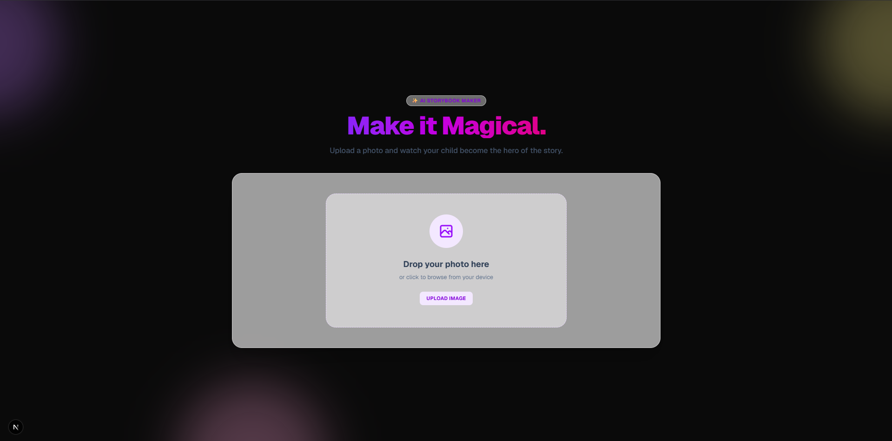
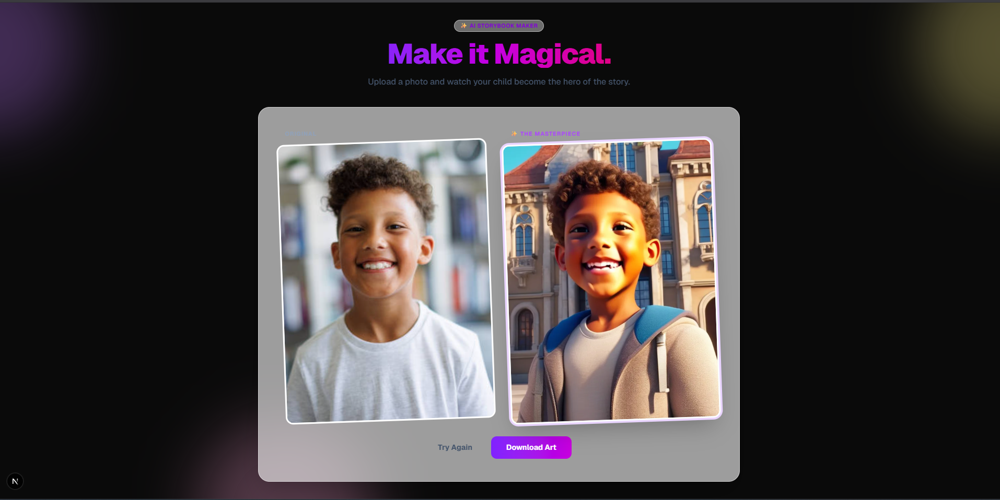

# ✨ StoryBook Magic

A personalized AI storybook generator that turns a child's photo into a high-fidelity, Disney-Pixar style illustration. Built with **Next.js**, **FastAPI**, and **Replicate (InstantID)**.


*The modern, glassmorphic UI designed for a magical user experience.*

## 🚀 Features
* **Zero-Shot Personalization:** No training required. Upload a photo and get a result in ~15 seconds.
* **High-Fidelity AI:** Uses `InstantID` (via Replicate) for state-of-the-art identity preservation + style transfer.
* **Robust Backend:** FastAPI server handles binary streams, file locking safety (Windows-compatible), and error recovery.
* **Magical UI:** Fully responsive Next.js frontend with TailwindCSS v4, glassmorphism, and smooth animations.

---

## 📸 Results

*Left: Original Upload | Right: AI Generated "Storybook" Style*


---

## 🛠️ Tech Stack
* **Frontend:** Next.js 14 (App Router), TailwindCSS, React
* **Backend:** Python, FastAPI, Uvicorn
* **AI Pipeline:** Replicate API (`zsxkib/instant-id`)
* **Style:** Custom CSS Animations & Glassmorphism

---

## 📂 Project Structure
```bash
pickabook-assgn/
├── backend/
│   ├── main.py            # FastAPI Application Entrypoint
│   ├── output.jpg         # Locally saved generation result
│   └── ...
├── frontend/              # Next.js Frontend Application
├── .env                   # API Keys (Not committed)
└── README.md
```

---
## ⚡ Getting Started
1. **Prerequisites**
* Node.js & npm

* Python 3.10+

* A Replicate API Key

2. **Environment Setup**
Create a `.env` file in the root directory and add your key:
```bash
REPLICATE_API_TOKEN=r8_YourKeyHere...
```

3. **Backend Setup**
Open a terminal in the root and run:
```bash
cd backend
# Create virtual env (optional but recommended)
python -m venv venv
# Windows: venv\Scripts\activate
# Mac/Linux: source venv/bin/activate

# Install dependencies
pip install fastapi uvicorn replicate python-dotenv python-multipart

# Start the server
uvicorn main:app --reload
```

*The backend will run on `http://localhost:8000`*

4. **Frontend Setup**
Open a new terminal window and run:

```bash
cd frontend
npm install
npm run dev
```
*The frontend will launch at `http://localhost:3000`*

---

## 📝 Architecture Diagram

graph TD
    subgraph Client ["Frontend (Next.js)"]
        UI[User Interface]
        Upload[Upload Component]
        Display[Result Display]
    end

    subgraph Server ["Backend (FastAPI)"]
        API[API Endpoint /generate]
        Temp[Temp File Handler]
        Static[Static File Server]
    end

    subgraph Cloud ["AI Cloud (Replicate)"]
        Model[InstantID Model]
        GPU[H100/A100 GPUs]
    end

    %% Data Flow
    User((User)) -->|1. Uploads Photo| UI
    UI --> Upload
    Upload -->|2. POST Image (FormData)| API
    
    API -->|3. Save Bytes| Temp
    Temp -->|4. Send File Handle| Model
    
    Model -->|5. Processing| GPU
    GPU -->|6. Return Image/Bytes| API
    
    API -->|7. Save to Disk| Static
    Static -->|8. Return URL| Display
    Display -->|9. View Result| User

---

## 📝 Engineering Decisions & Limits

### **Why InstantID?**
I chose **InstantID** (`zsxkib/instant-id`) over standard Face Swap or LoRA training for three specific reasons:
1.  **Identity + Style:** Unlike basic face swappers (InsightFace) which only copy eyes/mouth, InstantID reshapes the entire facial structure to match the target "Pixar" style while keeping the child recognizable.
2.  **Zero-Latency:** It does not require 20 minutes of fine-tuning (like Dreambooth). It works instantly, which is critical for a consumer checkout flow.
3.  **High Definition:** The model generates 4K-ready assets suitable for printing, whereas older models often output blurry 512x512 images.

### **Limitations**
* **Windows File Locking:** Encountered `WinError 32` when handling temporary files. Solved by implementing a memory-buffer read system to release file handles immediately.
* **Prompt Sensitivity:** The AI sometimes ignores specific background instructions if the "Identity Strength" is set too high.
* **One-Way Flow:** Currently supports one predefined "Scene" (European Stone Building)

### **Future Improvements (V2)**
* **Scene Selector:** Allow users to choose between "Magical Forest", "Space", or "Underwater" prompts.
* **Face Quality Check:** Implement OpenCV on the backend to reject blurry or obstructed faces before spending API credits.
* **Print-Ready Upscaling:** Integrate a final Super-Resolution pass (RealESRGAN) for 300 DPI book printing.

--- 

Made with ❤️ by Chetan Atram